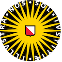

# Quran

This repository contains text and annotations of the Quran.

The corpus is modeled as a
[text-fabric data resource](https://github.com/annotation/text-fabric)
which is optimized for processing the text as data.
This makes it easier to do all kinds of research on the text.

2019-01-07: the Quran TF-app and data and tutorials released.

**This is work in progress: we need to do more testing and documenting**

We have taken the source materials from
[Quranic Arabic Corpus 0.4 (2011) by Kais Dukes](http://corpus.quran.com)
and
[Tanzil](http://tanzil.net/docs/tanzil_project).

The data in
[tf format](https://annotation.github.io/text-fabric/tf/about/fileformats.html)
is licensed as
[CC-BY 4.0](https://creativecommons.org/licenses/by/4.0/).

The conversion code and all other materials are licensed as
[Unlicense](http://unlicense.org), i.e. public domain.

Read more about provenance and license in
[About](docs/about.md).

Getting started
===============
Start with the
[tutorial](https://nbviewer.jupyter.org/github/q-ran/quran/blob/master/tutorial/start.ipynb).

# Documentation

The features are documented in
[features](docs/features.md).

English and Dutch translations of the Quran are included in the feature data.

# Authors

*   [Cornelis van Lit](http://uu.academia.edu/LWCornelisEricvanLit)
    
*   [Dirk Roorda](https://github.com/dirkroorda)
    
